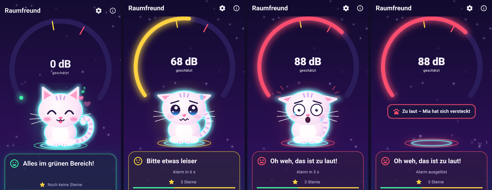

<!--
SPDX-License-Identifier: GPL-3.0-only
Copyright (C) 2026 Marcel Petrick <mail@marcelpetrick.it>
-->

# Raumfreund

[](https://github.com/marcelpetrick/Raumfreund/actions/workflows/ci.yml)
[](https://github.com/marcelpetrick/Raumfreund/actions/workflows/docker.yml)
[](https://github.com/marcelpetrick/Raumfreund/releases/latest)
[](LICENSE)
[](https://docs.flutter.dev/release/archive)
[](https://dart.dev/)
[](docs/toolchain.md)
[](docs/testing.md)
[](plan.md)

Raumfreund is a child-friendly Android noise traffic light for shared rooms.
It estimates the current sound level locally, shows an accessible green,
yellow or red state, and uses the cat Mia to encourage a quieter room. It is an
offline Flutter app for Android phones and tablets: no account, advertising,
tracking, audio archive or upload.

**Author:** Marcel Petrick <mail@marcelpetrick.it>

**License:** GPL-3.0-only; see [`LICENSE`](LICENSE).

**Note:** this project is generated with AI and reviewed through the repository
quality gates.

## Project status

Current version: **`0.3.1+26` — code-complete release candidate**

Raumfreund is a code-complete release candidate. The repository contains the
Flutter UI, Kotlin `AudioRecord` implementation, lifecycle-safe controller,
settings persistence, automated quality tooling, CI, Docker packaging and
release workflow. A public production release additionally requires the
owner's Android signing secrets and physical-device acceptance evidence. The
living status and external blockers are in [`plan.md`](plan.md).

The coverage badge reports the latest measured first-party Dart result; 95% is
the enforced minimum. It is not a claim that every platform path or product
requirement is already covered. Real microphone and lifecycle tests on two
Android devices remain mandatory before a production release.



From left to right: quiet room (screenshot from an Android 16 emulator),
"please be quieter" with the alarm countdown, too loud with Mia scared, and
Mia hiding after the alarm. The emulator microphone is silent, so the three
loud states are rendered from the app's real widgets in a widget test, not
captured on a device. The earlier design mockups are kept in
[`docs/mockups/`](docs/mockups/README.md).

**Download:** the newest installable APK is always the
[latest GitHub release](https://github.com/marcelpetrick/Raumfreund/releases/latest).
It is a debug-signed build for sideloading (Android 7.0+), not a Google Play
build.

## Major features

- Local microphone-level estimation without recording or transmitting audio.
- Accessible green/yellow/red feedback using text, icons, Mia's expression and
  animation rather than colour alone.
- Mia is happy in green, uneasy in yellow and scared in red. If it stays too
  loud until the alarm, she runs off and hides, and comes back only once the
  room is calm again.
- Zone hysteresis: peaks switch the light quickly, but it cools down slowly,
  so the colour does not flicker at a threshold and the text does not jump.
- Ten-second alarm rule with one alarm per loud yellow/red phase, never
  before the delay, and protection against retriggering on the app's own
  sound ([ADR 0004](docs/adr/0004-zone-hysteresis.md)).
- A 10-minute RAM-only timeline (one smoothed point per 10 s; peaks rise fast
  and cool down slowly) and quiet-minute stars.
- Configurable thresholds, calibration correction, alarm tone and vibration,
  persisted locally with validated schema migration.
- Dedicated Settings and About views; navigating away safely stops measurement.
- German localization, reduced-motion support and responsive phone/tablet UI.
- Reproducible pinned toolchain, 336 automated tests, 97.94% Dart coverage,
  Android lint, secret/vulnerability scans, Docker packaging and tag releases.

## Interaction

The main view provides one large start/stop action, an estimated 0–130 dB
gauge, German status text, Mia's matching expression, a 10-minute heartbeat
timeline and quiet-minute stars. Colour is never the only state indicator.
Opening another page always stops an active measurement safely; returning does
not restart it automatically.

The **Settings** button in the top app bar opens a separate view for the
yellow and red thresholds, calibration correction, alarm sound and vibration.
The view edits a working copy: **Speichern** validates and persists it,
**Abbrechen** discards it, and **Standardwerte** restores the proposed defaults.
Measurement stays stopped while settings are open and after returning.

The **About** button opens a read-only view with app/version/build details,
author and project links, the privacy summary, GPL notice and Flutter's
open-source license view. Opening and closing About follows the same stop and
no-auto-restart rule.

## Build and test

The repository pins Flutter `3.47.6` and its bundled Dart `3.13.5`. On supported
Linux x86-64 development hosts, the single quality gate is:

```sh
git clone https://github.com/marcelpetrick/Raumfreund.git
cd Raumfreund
./localPipeline.sh
```

It installs or verifies the pinned project-local tools, formats and analyzes
the code, checks the 100-line function limit, runs tooling and Flutter tests,
enforces the 95% Dart line-coverage floor, scans Markdown/YAML/workflows,
checks secrets and known vulnerabilities, builds an Android debug APK and
verifies the Docker image. Nothing is installed into the repository outside
ignored `.toolchain/`, build, coverage and report directories.

Individual steps can be selected while developing:

```sh
./localPipeline.sh --list
./localPipeline.sh --only format,analyze,test,coverage
```

Prerequisites, host limitations, Docker use and artifact locations are in
[`docs/building.md`](docs/building.md). Only commands actually run count as
evidence; the presence of this script is not proof of a green result.

## Documentation

- [`docs/architecture.md`](docs/architecture.md) — layers, data flow and state
  ownership
- [`docs/measurement.md`](docs/measurement.md) — dBFS conversion, calibration,
  smoothing and alarm input
- [`docs/privacy.md`](docs/privacy.md) — microphone and data-handling guarantees
- [`docs/testing.md`](docs/testing.md) — automated, emulator and device matrix
- [`docs/building.md`](docs/building.md) — local and Docker builds
- [`docs/releasing.md`](docs/releasing.md) — signing, tags, artifacts and rollback
- [`docs/play-store.md`](docs/play-store.md) — late-stage Play readiness
- [`docs/adr/`](docs/adr/) — accepted architecture decisions

Contributor workflow and security reporting are documented in
[`CONTRIBUTING.md`](CONTRIBUTING.md) and [`SECURITY.md`](SECURITY.md).

## Privacy and accuracy in one minute

Raumfreund processes short PCM windows in RAM and discards them immediately.
It must never write or transmit audio, and the release manifest must not request
Internet access. A phone microphone measures digital amplitude (dBFS), not a
calibrated sound-pressure level. The displayed value is therefore always marked
as estimated and is not suitable for occupational safety, legal evidence or
certified acoustic measurement. See [`docs/privacy.md`](docs/privacy.md) and
[`docs/measurement.md`](docs/measurement.md).

## Releases

Debug APK releases are published with one command from a clean, pushed
`main`:

```sh
tool/release_debug.sh --dry-run   # build, verify and print the notes only
tool/release_debug.sh             # tag debug-vX.Y.Z-buildN and publish
```

The script verifies checksum, version, permissions (no Internet) and the debug
certificate, and lists every changelog entry since the previous release. It
builds locally on purpose: all debug releases share this machine's debug
certificate, so a new release installs over the previous one.

Production releases require a matching `vX.Y.Z` tag, a green pipeline on that
exact commit, verified release signing, checksums, an SBOM, license inventory
and release notes. See [`docs/releasing.md`](docs/releasing.md).
