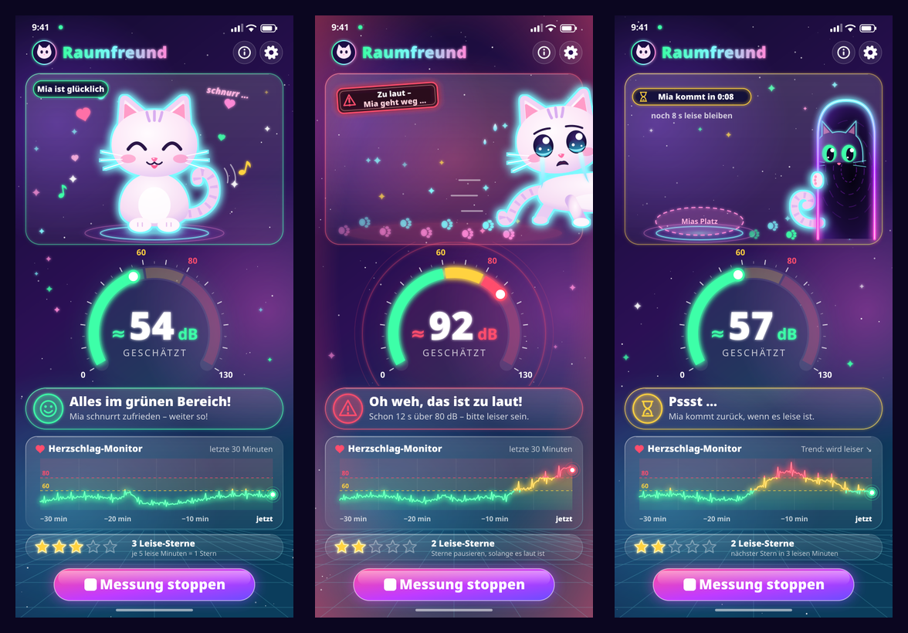

<!--
SPDX-License-Identifier: GPL-3.0-only
Copyright (C) 2026 Marcel Petrick <mail@marcelpetrick.it>
-->

# Main screen mockups

Three artwork mockups of the Raumfreund main screen (phone portrait, design
size 1080 × 2340). They are **design targets** created for this project. They
show the planned look and feel, not pixel-exact specs. If the Flutter
implementation and a mockup disagree, `Raumfreund-VISION.md` and `plan.md` win.



| File | State | Shows |
| --- | --- | --- |
| [`mockup-1-green-happy.svg`](mockup-1-green-happy.svg) ([PNG](mockup-1-green-happy.png)) | Green, ≈ 54 dB | Mia sits on a glowing stage ring and purrs (`^^` eyes, open smile, "schnurr …"), with floating hearts and notes and motion arcs on her swaying tail. Status: "Alles im grünen Bereich!", calm green trace, 3 of 5 stars. |
| [`mockup-2-red-walkaway.svg`](mockup-2-red-walkaway.svg) ([PNG](mockup-2-red-walkaway.png)) | Red, ≈ 92 dB | Mia cries big tears while walking out through the right edge of the screen. About half of her body is already gone, and glowing paw prints and motion lines trail behind her. A red alarm vignette and pulse rings glow around the scene, and a neon sign reads "Zu laut – Mia geht weg …". Status: "Oh weh, das ist zu laut!". The timeline spikes through yellow into red, and the stars are paused. |
| [`mockup-3-empty-room-return.svg`](mockup-3-empty-room-return.svg) ([PNG](mockup-3-empty-room-return.png)) | Back to green, ≈ 57 dB | The stage is empty, with a dashed "Mias Platz" cushion and paw prints leading to a neon portal at the right edge. Mia's glowing eyes and ears peek out of the portal, one paw grips the rim and her tail curls back into the room. The countdown chip reads "Mia kommt in 0:08". Status: "Pssst …" / "Mia kommt zurück, wenn es leise ist.". The timeline trends from red through yellow back to green. |

## Shared elements

- App bar with the "Raumfreund" title and the info and settings buttons.
- A 240° arc gauge from 0 to 130 dB with zone segments (green below 60,
  yellow from 60, red from 80), the big estimated value "≈ NN dB" and the
  caption "geschätzt".
- A status card that always combines **text and an icon** (smiley, warning
  triangle, hourglass), so colour never carries the meaning alone. Mia's face
  shows the state as well.
- "Herzschlag-Monitor": an ECG-like neon trace of the last 30 minutes, coloured
  by zone. It has zone bands, dashed threshold lines at 60 and 80, the labels
  "−30 min" … "jetzt" and a pulsing dot at the newest sample.
- A star counter for quiet minutes ("Leise-Sterne").
- The glowing pill button "Messung stoppen".

## Style

Deep night-sky gradient (`#120B2E` → `#2B1055` → `#0B3D5C`), stars, sparkles
and a retro-future perspective grid. Glassmorphism cards and neon glows built
from SVG filters (`feGaussianBlur` + `feMerge`, plus `feMorphology` for Mia's
cyan outline). Zone colours: mint `#3DFFA8`, yellow `#FFD23F` and pink-red
`#FF4D6D`.

## Technical notes

- Each SVG is pure and self-contained: no external fonts, images or scripts.
  Text uses a rounded font stack that falls back to `sans-serif`.
- Re-render the PNGs (540 × 1170) and the overview with:

  ```sh
  for s in docs/mockups/mockup-*.svg; do rsvg-convert -w 540 "$s" -o "${s%.svg}.png"; done
  magick docs/mockups/mockup-{1-green-happy,2-red-walkaway,3-empty-room-return}.png \
    -resize 360x -bordercolor "#0B0620" -border 14 +append +repage \
    -bordercolor "#0B0620" -border 6 -strip docs/mockups/overview.png
  ```

## License

The mockups were created for Raumfreund and are licensed under the project's
**GPL-3.0-only** license (see [`LICENSE`](../../LICENSE)). Every SVG has the
SPDX header `SPDX-License-Identifier: GPL-3.0-only` and
`Copyright (C) 2026 Marcel Petrick <mail@marcelpetrick.it>`.
